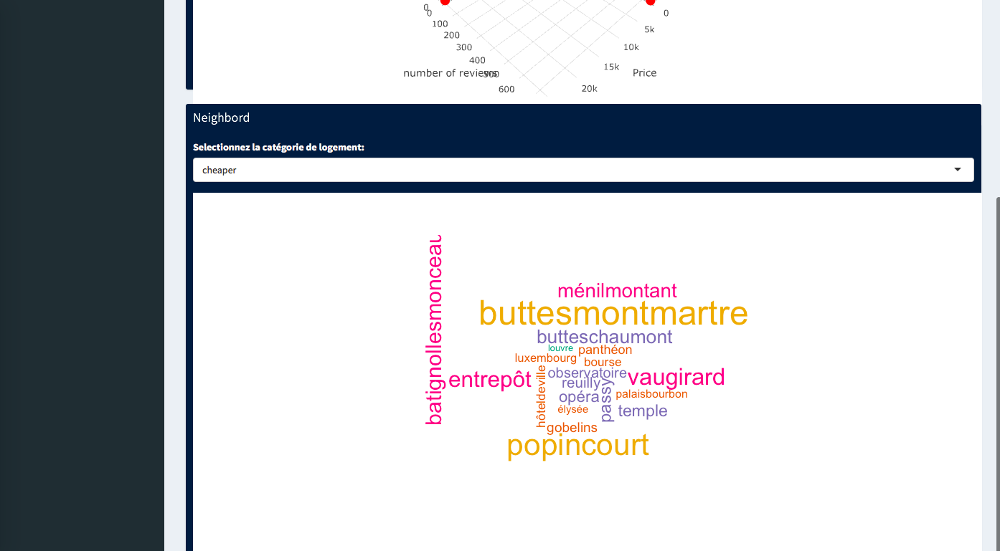
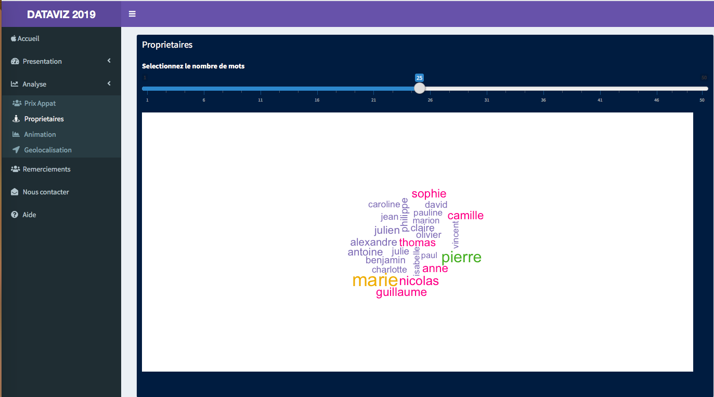

# PROJET DATA VISUALIsATION MARS 2019 MBA ESG
## Data visualization with shiny
1- **Page d'Accueil** /

2- **présentation des données**/
Nous disposons disposons d'une base données de **59881** observations et **18** colonnes. cette base de données represente les logements Airbnb à Paris.
Elle est composée de 3 types de logements
**- Entire homm/apt**
**- Private room**
**- Shared room**

3-**Visites, Location et prix**
ce graphique en 3D nous permet de voir comment varient les visistes sur site, et la location d'un logement par rapport à son prix.

4- **Emplacement du logement**
Il existe une forte corrélation entre l'emplacement du logement et son prix. 
Ainsi les logements situés au niveau des Champs Elisée resortent comme les logements les plus chers. 

5- **Les Propriétaires**
Nous aimerions connâitre les noms de propriétaires qui resortent souvent quand on parle de logement sur Airbnb.
Ici, plus le nom est gros, plus il ressort souvent dans la liste des propriétaies.

6- **Animation**
Ici sont des vidéos, reprentant l'évolution des visites de logement selon le prix entre 2010 et 2018.

 
 On fait un zoom sur l'année 2018

 **Représentation géographique des logements**
 les points en rouge représentent les logements les plus chèrs 

**Nos Remerciements**

**Pour nous contacter**

